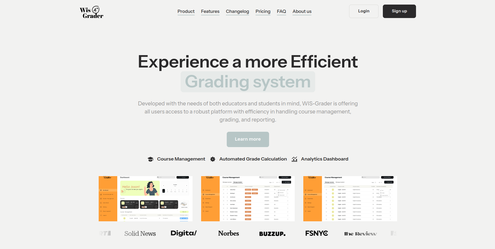
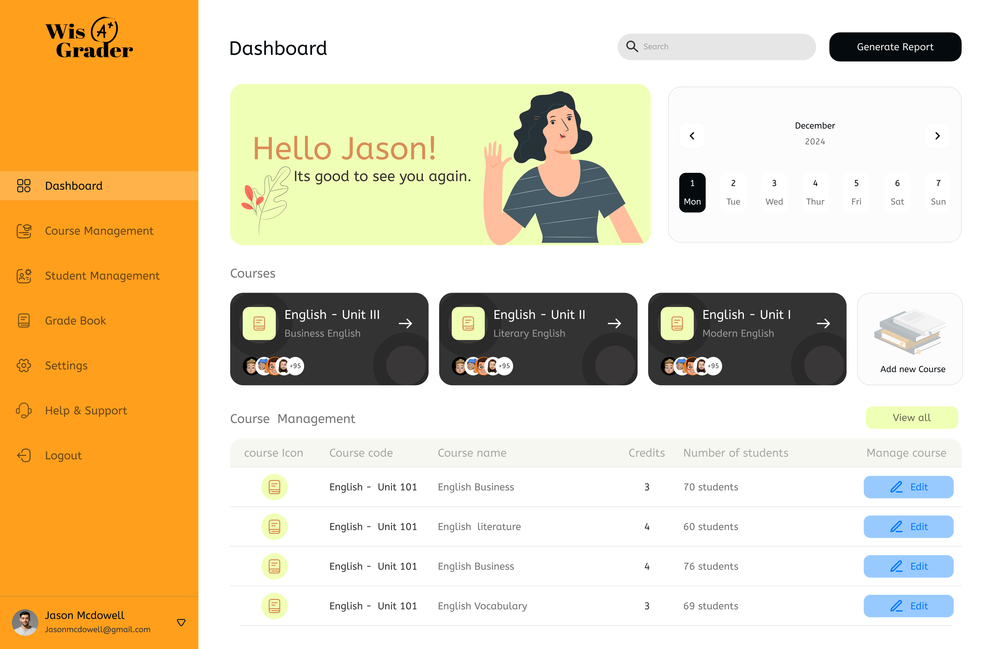
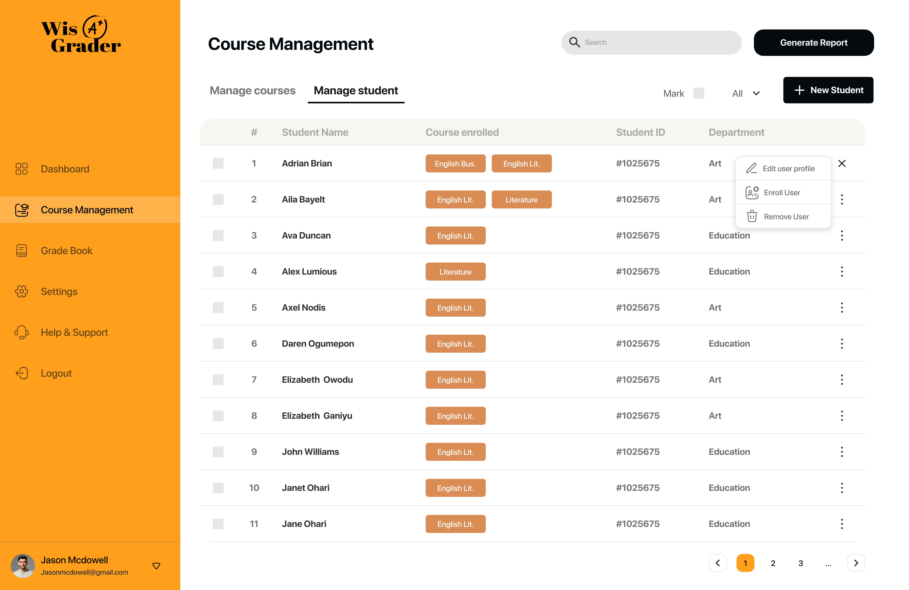
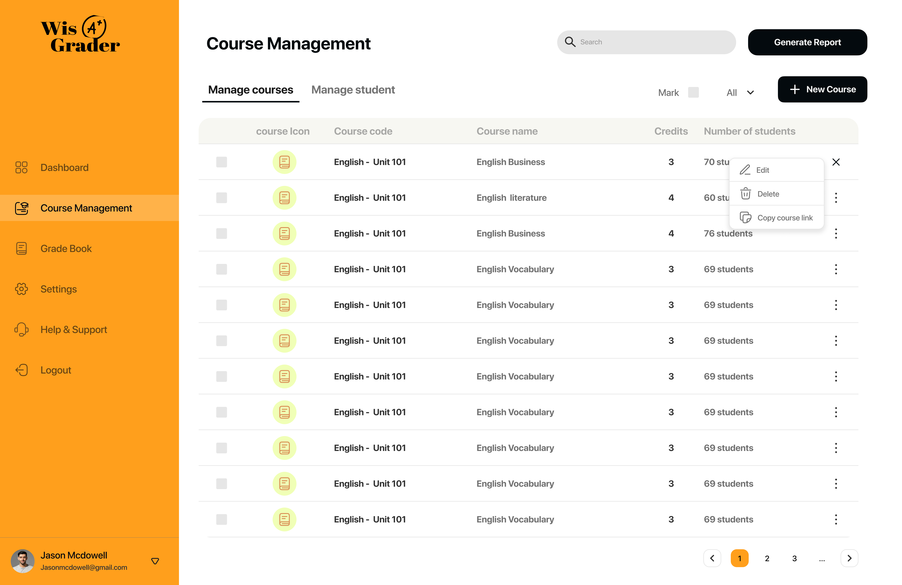

# WIS Grader

## Introduction



WIS Grader is a robust grading and student management platform designed to simplify the academic grading process for lecturers and institutions. It enables lecturers to manage students, track their progress, and assign grades effortlessly. With a user-friendly dashboard, API-powered backend, and seamless frontend integration, WIS Grader bridges the gap between student performance and efficient grading workflows.

You can find the live version of the project [here](#deployed-site). Also, check out the project blog article [here](#blog-link), and connect with the authors on LinkedIn].
[Wisdom Okposin](https://www.linkedin.com/in/wisdom-okposin/), [Solomon C. Nwante](https://www.linkedin.com/in/solomon-c-nwante-539986162/), and [Idris Elgarrab](https://www.linkedin.com/in/idris-el-garrab-8b749217b/)

## Table of Contents

- [Installation](#installation)
- [Usage](#usage)
- [Contributing](#contributing)
- [Related Projects](#related-projects)
- [Licensing](#licensing)
- [Screenshot](#screenshot)
- [Technical Challenges & Story](#technical-challenges--story)

## Installation

To install and run this project locally, follow these steps:

**1. Clone the Repository**  

   ```bash
   git clone https://github.com/yourusername/wis-grader.git
   cd wis-grader
   ```

**2. Set up a Virtual Environment**

   ```bash
   python3 -m venv venv
   source venv/bin/activate
   ```

**3. Prepare your system**

To install all the necessary dependencies for the WIS Grader project, run the following setup script:

   ```bash
   bash setup.sh
   ```

The `setup.sh` script will automatically install the required packages, including:
                                                                                                                                                                                                            
- **Python 3 and development tools** (`python3`, `python3-dev`, `python3-pip`, `python3.10-venv`)
- **MySQL client library** (`libmysqlclient-dev`)
- **MySQL server** (`mysql-server`)
- **Redis server** (`redis-server`)
- **Additional utilities** (`pkg-config`)

**4. Install Dependencies**

   ```bash
   pip install -r requirements.txt
   ```
**5. Setup database**

   ```bash
   sudo mysql < setup_mysql_test.sql
   ```

**6. Environment Setup**

Before running the application, you need to set up the environment variables for the database connection. Run the following commands:

```bash
export WIS_USER="wis_test"
export WIS_DATABASE="wis_test_db"
export WIS_PASSWORD="wis_test_pwd"
```

**7. Run the app**

After installing the dependencies, you can start the WIS Grader application by running the following commands:

- To run the main application, execute:
   ```bash
   python3 -m app.app
   ```
- After that, you need to run the API, open another terminal (or use a tool like Tmux) and execute:
   ```bash
   python3 -m api.v1.app
   ```
## Usage

Once the application is running, the following features are available:

* **Lecturer Dashboard**: Manage students, courses, and grades.
* **Course Management**: Create and edit courses, assign students to courses.
* **Student Management**: Create student profiles, update registration details, view academic performance.
* **Grading System** : Enter test scores, exams, and compute final grades automatically.

To access the WIS Grader API:

* Navigate to **http://127.0.0.1:5000/apidocs**
* Use the provided API documentation (Swagger) to explore various endpoints:
   * /api/v1/students
   * /api/v1/courses
   * /api/v1/lecturers

## Contributing

We welcome contributions to WIS Grader! Here’s how you can contribute:

* **1. Fork the Repository**

Click on the “Fork” button at the top right corner of this page.

* **2. Create a Branch**
   ```bash
   git checkout -b feature/new-feature
   ```
* **3. Commit Your Changes**

Make your changes and commit them with a clear message:
   ```bash
   git commit -m "Add feature X"
   ```

* **4. Submit a Pull Request**

Push your changes to the branch and create a pull request.

We follow the PEP8 coding style for Python, so please ensure that your code adheres to this standard.

## Related Projects

* **WikiGraph**: A visualization tool for exploring Wikipedia articles.
* **Job Odyssey**: A web-based job-hunting management system.

## Licensing
This project is licensed under the MIT License - see the LICENSE file for details.

## Screenshot
Here's a sneak peek of the WIS Grader dashboard:






.png)




## Technical Challenges & Story

The WIS Grader project was born out of a need to streamline the grading process for lecturers. We wanted to create a tool that could help educators manage courses and students with ease while automating the computation of final grades based on test scores and exams.

One of the technical challenges we faced was integrating the frontend with the backend APIs while ensuring a smooth user experience. We leveraged Flask for the backend, SQLAlchemy for database management, and Swagger for API documentation. The challenge was managing authentication and session data across different services, especially when handling cookies and tokens. After several iterations, we implemented a solution that involved forwarding the token from the backend to the frontend, which then handled the cookie management via JavaScript.

Another major hurdle was building a flexible database schema that could accommodate future enhancements like support for different grading scales or adding more complex course prerequisites. We designed the database using MySQL and took care to normalize the tables to avoid redundancy and maintain efficiency.

We also implemented a clean separation of routes, ensuring that each route module focuses on specific functionalities, making the codebase more modular and maintainable.

## Struggles & Solutions

### Building a Flexible and Scalable Database
We faced the challenge of creating a solid database schema that would be flexible and scalable for future enhancements. We needed a design that could accommodate different grading scales and academic structures. To solve this, we carefully normalized the database tables using SQLAlchemy and MySQL, ensuring relationships between `students`, `courses`, `grades`, and `lecturers` were well-defined. This allowed us to keep the database efficient, without redundancy, while making it easier to extend in future versions.

### Building a Solid Authentication System
Creating a secure and scalable authentication system was another key challenge. Initially, we considered different ways to handle authentication, but after reviewing the complexity, we opted to use Redis for session management and cookies for token storage. By implementing Redis, we were able to efficiently manage user sessions, while cookies allowed us to ensure secure login and logout functionalities across different endpoints.

### API Integration with Third-Party Services
One major issue we encountered was authentication with third-party APIs like Brevo (formerly Sendinblue) for email verification during user signup. Initially, we struggled with managing API keys through environment variables. We solved this by switching to configuration files, which allowed for better control and management of authentication tokens, resulting in smoother API integration.

### Frontend-Backend Synchronization
Ensuring that the frontend (JavaScript) worked seamlessly with the backend was another critical point. Managing asynchronous form submissions, especially for login and registration, required careful handling of tokens and cookies. After some debugging and iterations, we created a system where the token was retrieved by the backend and sent to the frontend, which would then store it as a cookie, ensuring proper session management.

## Next Iteration
In future versions, We plan to expand the platform to support multiple institutions with varying grading systems. We also envision adding real-time notifications, allowing students to receive instant feedback on their grades as soon as they're updated.

This is a living project, and We’re excited about where it’s heading. Feel free to fork it, submit issues, or join the development journey! 😊
